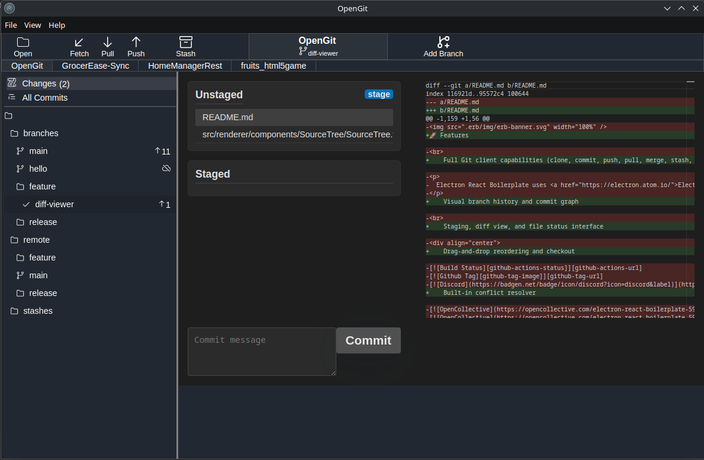

# OpenGit
OpenGit is a free, open-source Git client built with modern web technologies. It provides a user-friendly interface for version control operations, making Git more accessible to developers of all skill levels. Built on Electron, React, and TypeScript, OpenGit combines the power of Git with a clean, cross-platform desktop experience.

---


---

## Features
- Intuitive GUI for common Git operations (commit, push, pull, branch, etc.)
- Cross-platform support (Windows, macOS, Linux)
- Repository visualization with commit history graph
- Diff viewer with syntax highlighting
- Responsive and customizable interface
- Dark theme support
- Built with TypeScript for type safety
- Modern React-based UI components

---

## License
OpenGit is released under the **GNU GENERAL PUBLIC LICENSE Version 3**. See [LICENSE](LICENSE) file for details.

---

## Installation
### Prerequisites
- Node.js (v16 or higher recommended)
- npm (v8 or higher) or yarn
- Git (for version control operations)

### Download and Install
1. Download the latest release for your platform from the [Releases page](https://github.com/Spuk1/OpenGit/releases)
2. Install the application following your operating system's standard procedures

---

## Development Setup
### Clone the Repository
```bash
git clone https://github.com/Spuk1/OpenGit.git
```
### Open the Folder
```bash
cd OpenGit
```
### Install modules
```bash
npm install
```
### Start development server
```bash
npm run start
```

### Package into an executable for your System
```bash
npm run package
```
